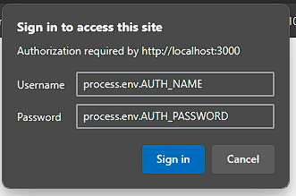

# Cinnabar OTP (One-Time Password Sender)

I build free One-Time Password (OTP) Sender based on NodeJS, Express, and TypeScript

#### WARNING: DON'T USE THIS APPLICATION TO SPAM SOMEONE !

## Features

- WA 
- Telegram (Coming Soon(?))

## To Do
- Migration (because of using v7.0/alpha)
- Telegram Support

## Environment Variables
### Example
```sh
# APP CONFIGURATION
PRIVATE_API_KEY="api-key"
NAME="member" # WA Client Name
SESSION="session" # WA Session Name
PORT=3000

# LOGIN PAGE
AUTH_NAME=admin # Login Page Auth Name
AUTH_PASSWORD=admin # Login Page Auth Password

# DATABASE
DB_NAME=db
DB_USER=root
DB_HOST=localhost
DB_DRIVER=mysql
DB_PASSWORD=root

# SETTINGAN OTP
FIRST_STATEMENT='Kode OTP Anda untuk mengakses adalah'
LAST_STATEMENT='pastikan jaga kerahasiaan kode anda dari siapapun!'
OTP_LIFETIME=2 # Lifetime OTP, kalikan dengan 1 menit
OTP_MAX_ATTEMPTS=3 # Maks bisa spamming OTP
```

|Object Field | Required | Description|
|-------------|----------|------------|
|`PRIVATE_API_KEY`| yes | Your own api key for security
|`NAME`| yes | Client name
|`SESSION` | yes | Session name, it will use for Authentication 
|`OTP_LIFETIME` |yes | OTP lifetime, number will be times with one minute
|`OTP_MAX_ATTEMPTS` |yes | Maximum attempts users can do if the `otpCode` is wrong

## Login
`GET /auth/`



### Authentication
|Object Field | Required | Description|
|-------------|----------|------------|
|`username`| yes | `process.env.AUTH_NAME`
|`password`| yes | `process.env.AUTH_PASSWORD`
|`session` | yes | `process.env.SESSION`

> Note: If you failed to login, refresh to get new QR code and ASAP scan it!

## Routes

### Request OTP
`POST /otp/`

#### Request Header
`API-Key` is required. Get from `PRIVATE_API_KEY` from your `.env` file.

#### Request Body
A JSON-encoded object for the otp. The `phoneNumber` is required, and reservable_ports must be included if type is tcp.

|Object Field | Type | Required | Description|
|-------------|------|----------|------------|
|`phoneNumber`| `number`| yes | Receiver phone number (use country code without **+**)

#### Example Request
```bash
curl -vvv -H "API-Key: api-key" http://example.com/otp/ -X POST -d '{"phoneNumber": 6281212341234}'
```
#### Response
  Expected Status `201 Created`

#### Response Body
A JSON-encoded object for the updated `Router Group`.

| Object Field       | Type   | Description |
|--------------------|--------|-------------|
| `id`             | number | id
| `otpCode`             | number | OTP Code
| `phoneNumber`             | number | Receiver phone number (use country code without **+**)
| `attempt` | number | Last attempts to verify the OTP
| `isUsed` | boolean | OTP Code is used or not
| `createdAt` | datetime | Date OTP Created
| `updatedAt` | datetime | Date OTP Used

#### Example Response:
```json
{
    "id": 7,
    "otpCode": 354101,
    "phoneNumber": 6281212341234,
    "attempt": 0,
    "isUsed": false,
    "createdAt": "2023-11-11T16:46:07.000Z",
    "updatedAt": "2023-11-11T16:46:07.000Z"
}
```

### GET OTP From Phone Number
`GET /otp/`

#### Request Header
`API-Key` is required. Get from `PRIVATE_API_KEY` from your `.env` file.

#### Request Query
A JSON-encoded object for the otp. The `phoneNumber` must be includeed.

|Object Field | Type | Required | Description|
|-------------|------|----------|------------|
|`phoneNumber`| `number`| yes | Receiver phone number (use country code without **+**)

#### Example Request
```bash
curl -vvv -H "API-Key: api-key" http://example.com/otp/?phoneNumber=6281212341234
```
#### Response
Expected Status `200 OK`

#### Response Body
A JSON-encoded object.

| Object Field       | Type   | Description |
|--------------------|--------|-------------|
| `otp`             | object | Request OTP

#### Example Response:
```json
{
    "otp": {
        "id": 8,
        "otpCode": 549783,
        "phoneNumber": 6281212341234,
        "attempt": 0,
        "isUsed": false,
        "createdAt": "2023-11-11T16:51:06.000Z",
        "updatedAt": "2023-11-11T16:51:06.000Z"
    }
}
```

### Resend OTP
`POST /otp/resend`

#### Request Header
`API-Key` is required. Get from `PRIVATE_API_KEY` from your `.env` file.

#### Request Body
A JSON-encoded object for the otp. The `phoneNumber` must be included.

|Object Field | Type | Required | Description|
|-------------|------|----------|------------|
|`phoneNumber`| `number`| yes | Receiver phone number (use country code without **+**)

#### Example Request
```bash
curl -vvv -H "API-Key: api-key" http://example.com/otp/resend -X POST -d '{"phoneNumber": 6281212341234}'
```
#### Response
  Expected Status `202 Accepted`

#### Response Body
A JSON-encoded object.

| Object Field       | Type   | Description |
|--------------------|--------|-------------|
| `message`             | string | Message from API
| `info`             | object | Response Body Request OTP

#### Example Response:
```json
{
    "message": "success resending otp code",
    "info": {
        "id": 9,
        "otpCode": 809560,
        "phoneNumber": 628112341234,
        "attempt": 0,
        "isUsed": false,
        "createdAt": "2023-11-11T16:55:11.000Z",
        "updatedAt": "2023-11-11T16:55:11.000Z"
    }
}
```
### Use OTP
`PUT /otp/`

#### Request Header
`API-Key` is required. Get from `PRIVATE_API_KEY` from your `.env` file.

#### Request Body
A JSON-encoded object for the otp. The `phoneNumber` and `otpCode` must be included

|Object Field | Type | Required | Description|
|-------------|------|----------|------------|
|`phoneNumber`| `number`| yes | Receiver phone number (use country code without **+**)
|`otpCode`| `number`| yes | OTP Code

#### Example Request
```bash
curl -vvv -H "API-Key: api-key" http://example.com/otp/ -X PUT -d '{"phoneNumber": 628121234123, "otpCode":28374}'
```
#### Response
Expected Status `200 OK`

#### Response Body
A JSON-encoded object

| Object Field       | Type   | Description |
|--------------------|--------|-------------|
| `message`             | string | Message from API
| `info`             | object | Response Body Request OTP

#### Example Response:
```json
{
    "message": "verification success",
    "info": {
        "id": 10,
        "otpCode": 137764,
        "phoneNumber": 6281212341234,
        "attempt": 0,
        "isUsed": false,
        "createdAt": "2023-11-11T16:58:52.000Z",
        "updatedAt": "2023-11-11T16:58:52.000Z"
    }
}
```

### Send Message
`POST /message/`

#### Request Header
`API-Key` is required. Get from `PRIVATE_API_KEY` from your `.env` file.

#### Request Body
A JSON-encoded object for the otp. The `phoneNumber` and `message` must be included.

|Object Field | Type | Required | Description|
|-------------|------|----------|------------|
|`phoneNumber`| number| yes | Receiver phone number (use country code without **+**)
|`message`| string | yes | Message to send

#### Example Request
```bash
curl -vvv -H "API-Key: api-key" http://example.com/message/ -X POST -d '{"phoneNumber": 628121234123, "message":"abv"}'
```
#### Response
Expected Status `200 OK`

#### Response Body
A JSON-encoded object

| Object Field       | Type   | Description |
|--------------------|--------|-------------|
| `message`             | string | Message from API
| `info`             | object | Request Body

#### Example Response:
```json
{
    "message": "success sending message",
    "info": {
        "phoneNumber": 6281212341234,
        "message": "abc"
    }
}
```

## License
Copyright (c) 2023 Palguno Wicaksono

The copyright holders grant the freedom to copy, modify, convey, adapt, and/or redistribute this work under the terms of the GNU General Public License v3.0.
A copy of that license is available at [`LICENSE`](https://github.com/icaksh/cinnabar-otp-sender/blob/master/LICENSE)
